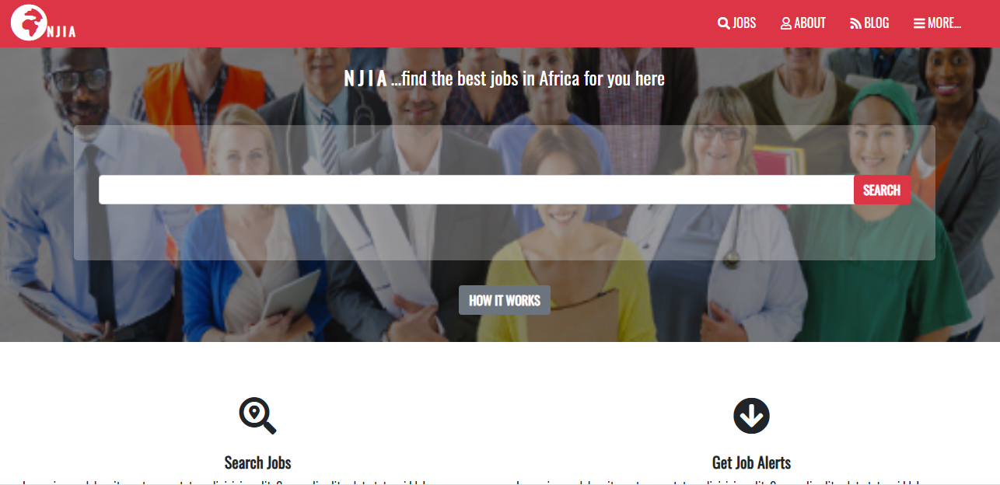

# Needajobinafrica.com
This is a microverse capstone project to build a directory website. My website is a job directory to find jobs for professionals in Africa. It has three pages (homepage, search and search result pages) for different job openings and a detailed page for a particular job.
This is a solo project to build a responsive website using HTML5, bootstrap &amp; CSS.

## Built With

- HTML5
- CSS
-Bootstrap

## Project specific

- Aligned all elements with boostrap, CSS flexbox, grid and float.
- Used a mobile first approach when dealing with mediaqueries with 2 breakpoints.
- Double-check for breakpoints of page layout on different screens.

## Live Demo

[Live Demo Link](https://rawcdn.githack.com/KossySteve/Needajobinafrica.com/f712cd9f6f865624945beb7479faf903539a1ce6/index.html)

## Authors

👤 **Ezeokwelume Kosisochukwu Stephen**

- Github: [@KossySteve](https://github.com/KossySteve)
- Twitter: [@EzeSteve3](https://twitter.com/EzeSteve3/)
- Linkedin: [linkedin](https://www.linkedin.com/in/steve-ez-b090ba198/) 

## Project Owners
👤 **Mathew Njuguna & Sam Achola**

-  Behance, Nairobi, Kenya
 

## 🤝 Contributing

Contributions, issues and feature requests are welcome!

Feel free to check the [issues page](issues/).

## Show your support

Give a ⭐️ if you like this project of mine!
